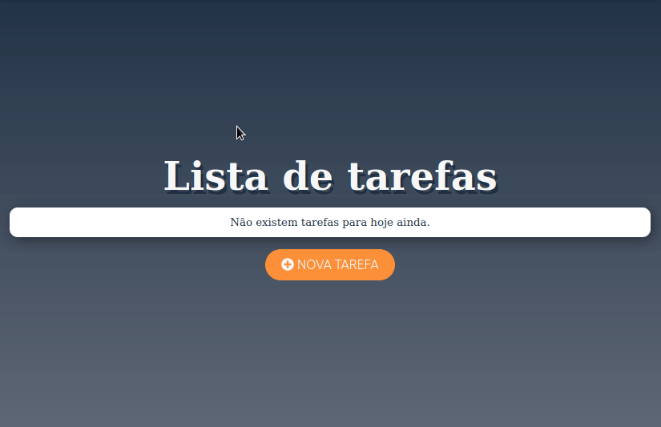
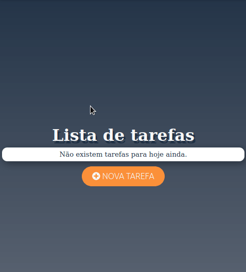

# 📝 TodoAng

A todo list app made in Angular 10 and using Express.Js to run in Heroku.

[See my app here](https://todoang.herokuapp.com/)

***

***

## 🚀 Technologies

- ✔️ Angular10

- ✔️ TypeScript

- ✔️ ExpressJs

- ✔️ HTML

- ✔️ CSS

***

## License

This project is under the MIT license. See the [LICENSE](./LICENSE) for more information.

***

Made with ♥️ by RANIEL SOBRINHO 👉 [LinkedIn](https://www.linkedin.com/in/raniel-sobrinho-1b249514b/)
